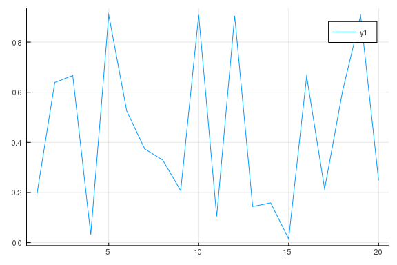

# Directly loads in the Plots.jl module for plotting 
````julia
using Plots
````


# Selecting GR as the backend for Plots 
````julia
gr()
````


````
Plots.GRBackend()
````


# Generating 20 random data points
````julia
x = 1:20
y = rand(20)
````


````
20-element Array{Float64,1}:
 0.18911921836651002
 0.6390991386880818 
 0.6667297067492413 
 0.03218610439507463
 0.9087567636590712 
 0.5251853408977072 
 0.37398061079652933
 0.32948772470333454
 0.20741334901469455
 0.9083741557205054 
 0.10461879833975596
 0.9049817633699255 
 0.14417103214936522
 0.1587577378173768 
 0.01506843327690377
 0.663618356325248  
 0.2139763309377336 
 0.6058103455477517 
 0.9063564894209228 
 0.2484327205223169
````


# Plots random data to line plot
````julia
plot(x, y)
````



